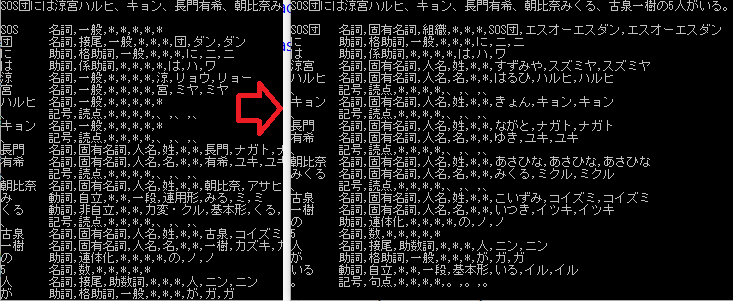

# NMeCab-Test



## Create user dictionary

```powershell
mecab-dict-index -d "C:\Program Files (x86)\MeCab\dic\ipadic" -u ./dic/userdic/haruhi.dic -f sjis -t utf-8 .\haruhiDic.csv
```

## NMeCab

LGPL v2.1

https://ja.osdn.net/projects/nmecab/

## MeCab

http://taku910.github.io/mecab/

